----
Project for the course in Effective Programming Practice | Winter 20/21, M.Sc. Economics, Bonn University | [Hyein Jeong](https://github.com/huiren-j)
# Replication of R. Dizon-Ross (2014)  <a class = "tocSkip">
----

**This repository** contains my replication of the results from the following paper:

> Dizon-Ross, Rebecca. 2019. "Parents' Beliefs about Their Children's Academic Ability: Implications for Educational Investments." American Economic Review, 109 (8): 2728-65.  
    

This repository is constructed by a template offered by --add. Thus the required **environment** is originally included in this template and can be generated by environment.yml.
    
**This replication** consists of files to produce 4 tables and 4 figures. In order to see the tables directly, simply run `"table_produce.py"` in "../src/final". It contains functions defined at `"tables_management.py"` and `"tables_analysis.py"`. Each files include codes to prepare for analysis and to run the regressions. For the case of figures, they would be also produced by running `"figures_produce.py"`. Likewise, the detailed functions for generating figures are in `"figures_management.py"` and `"figures_analysis.py"`. All data for the analysis are in "src/original_data". In addition, I appended a short extenstion to show relation between education and parents' financial status with evidence of Seoul, the capital city of South Korea. This part will visualize land price and the number of private institute related to university entrance exams by district level. In order to see this result, use `"extension_produce.py"`. As like did in figures and tables, this final file is supported by `"extension_management.py"`and `"extension_analysis.py"`.

    
 

---

    
    
<h1>Table of Contents</h1>
<ul class="toc-item"><li><a href="#1.-Introduction" data-toc-modified-id="1.-Introduction-1">1.Introduction</a></li>
<li><a href="#2.-Empirical Approach" data-toc-modified-id="2.-Empirical Approach-2">2.Empricial Approach</a></li>
<li><a href="#3.-Experimental Design and Outcomes(Data)" data-toc-modified-id="3.-Experimental Design and Outcomes(Data)-3">3.Experimental Design and Outcomes(Data)</a></li>
<li><a href="#4.-Empirical Results" data-toc-modified-id="4.-Empirical Results-4">4.Empirical Results</a></li>
<ul class="toc-item"><li><a href="#4.1. Beliefs" data-toc-modified-id="#4.1. Beliefs-4.1">4.1. Beliefs</a></li>
<li><a href="#4.2. Results: Experimental Outcomes" data-toc-modified-id="##4.2. Results: Experimental Outcomes-4.2">4.2.Results: Experimental Outcomes</a></li>
</ul><li><a href="#5. Extension: Application to South Korea" data-toc-modified-id="5.Extension: Application to South Korea">5. Extension: Application to South Korea</a></li>
<ul class="toc-item"><li><a href="#5.1. The distribution of private institutes" data-toc-modified-id="##5.1.The distribution of private institutes">5.1. The distribution of private institutes</a></li>
<li><a href="#5.2. The average living purpose land price by districts" data-toc-modified-id="##5.2.The average living purpose land price by districts">5.2. The average living purpose land price by districts</a></li>    
</ul><li><a href="#6.-Conclusion" data-toc-modified-id="6.-Conclusion-6">6.Conclusion</a></li>
<li><a href="#7.-Reference" data-toc-modified-id="7.-Reference-7">7.Reference</a></li>

 
 
    
---
# 1. Introduction
---
    
 
    
Dizon-Ross(2019) examined parents' beliefs about their children's academic ability. Since Parents are the decision maker for their children's education investment, it is important for parents to have good standard for the investment. The author argues that educational investment decision depends on the parents' beliefs about their children's academic ability. This kind of belief is generally formed by school report cards which is available for all for free. However, the author points out that this is not the case. Parents can be a factor to make differences in availability of the information about their children's academic performance. For example, if the parents have low level of education than their children's currently do, then it would be difficult for the parents to evaluate their children's school performance accurately. That is, parents could have inaccurate belief about their children's school performance due to lack of information and it lead the parents to make wrong investment decision on education.
    

 
    
The main hypothesis is that parents' investment decisions rely on their beliefs. Figure 1. shows that the relation between beliefs and investments based on the hypothesis. PanelA implies that parents have prospensity to underestimate their children's ability if children's achievements are high, and to overestimate if children's achievements are low. Therefore, the author argues that if current investment is depending on their accurate beleifs, then correcting their beliefs by delievering accurate information will attenuate the slope on beliefs.
    
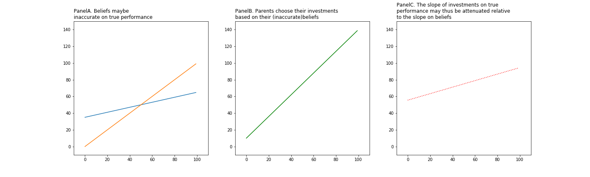
 
 

---
# 2. Empirical Approach
---

Parents' investment on education implies both the *level* of spending and the specific *type* of educatinal resources for each child.
The peceived production function for child j's quality is

where  = parent i's investment choice for child j, = child j's baseline academic performance, and function f is concave in .

In addtion, we assume that parent i's investment choice  is to maximize household utility:

Lastly, assume parent i does not know child j's true performance. That is the parents formulate their own belief  described by distribution 
where  means parent i's *belief* about child j's academic ability and  means parents' belief uncertainty.

 
    
    
---
# 3. Experimental Design and Outcomes(Data)
---

### 3.1. Experimental Design
 

- <u>Sample selection</u>
:The study worked with 39 schools in two districts in Malawi. Schools were selected randomly form the universe of primary schools. The experiment subject is student in grades 2 to 6. Also, this experiment is conducted by selecting siblings in this target grade. If there are more than 2 sibilings from one household, then two of them were chosen randomly.
    
    
- <u>Randomization</u>
    : The treatment is infromation intervention. That is one half of the chosen households will be delievered an accurate information about their children's school performance. This treated group was selected randomly. The randomization is based on a test score measure and a proxy for parent education.
    
- <u>Eligibility Inverviews</u>
    : These above process were conducted based on data gathered from students at school and on school administrative data. Among 3,451 sampled households, 21 percent of households were found to be ineligible during the parent intervies. Thus, final experimental sample comprises 5,268 parent-child pairs.

### 3.2. Experiment Outcomes(Data)
 

**Overview of Data Collection**

<table style = "margin: auto; text-align: center;">
    <thead>
        <tr>
            <th colspan = 3>
Day 1
</th>
            <th>0-12 months post-intervention</th>
        </tr>
    </thead>
    <tbody>
        <tr>
            <td ><i>Baseline survey</i></td>
            <td ><i>Information invervention</i></td>
            <td><i>First endline survey</i></td>
            <td ><i>
Longer-term outcomes
</i></td>
        </tr>
        <tr>
           <td >Gather baseline
                data (expenditures, perceived returns to
                education, etc.)</td>
           <td >Deliver report
                card with “academic
                performance,”(Treatment group only)</td>
           <td>Measure
                “experimental
                outcomes”</td>
            <td>Measure
            attendance in
            following month</td>
        </tr>
        <tr>
            <td >Elicit parents’
                baseline beliefs about
                their children’s
                “academic
                performance”</td>
            <td></td>
            <td>Measure endline
                belief measure</td>
            <td>Second endline
            survey 1 year after</td>
        </tr>
    </tbody>
</table>
 

---
# 4. Empirical Results
---
    
### 4.1. Beliefs
    
#### 4.1.1. Result A1: *Parents' beliefs about academic performance are inaccurate*

PanelA of Figure 2 presents the average of the absolute value of the gap between parents' mean beliefs about their children's academic performance and their children's true academic performance. As you can see the PanelA shows that the average gap of each groups is almost same before information intervention. However, PanelC suggests that the average gap diverged after information intervention. That is, when they are asked about likely schore on a hypothetical test, their beliefs(answers) turned out differentiated. Moreover, the treated group went through larger changes compared to control group, the direction of change is negative. This implies that information intervention make a role of reducing gap between parents inaccurate beliefs and true score.  
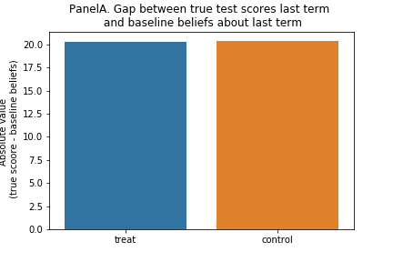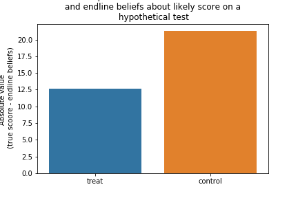
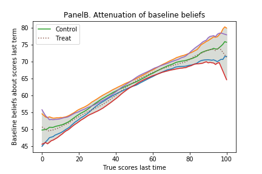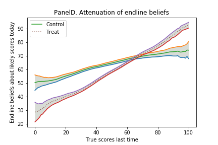
    
#### 4.1.2. Result A2: *Providing information aligns beliefs better with students' test scores*

This finding is induced by comparing baseline beliefs with endline beliefs. The baseline beliefs are from the survey before information intervention for treatment groups. In order to see whether the information aligns beliefs better, we should confirm that the beliefs of control group do not change substantially. We could confirm it through the above Figure PanelA and C. While the treatment group adjusted their beliefs, the control group parents responded smilar degree of beliefs in the endline with those in the baseline. This result verifies that the hypothesis which parents have accurate beliefs due to lack of information.

    
 

### 4.2. Results: Experimental Outcomes 

#### 4.2.1 Result B1: *Control group parents attempt to tailor their investments to performance, but partly fail.*

Figure 3. compares the preferred investment investment function (investments plotted against believed performance: the dashed line) with the actual investment function (investments plotted against true performance: the solid lines). Panel A1 and A2 of Figure 3 presents the results for math and English workbook difficulty choices graphically. Recall that for each book, parents could choose from three different difficulty levels.   
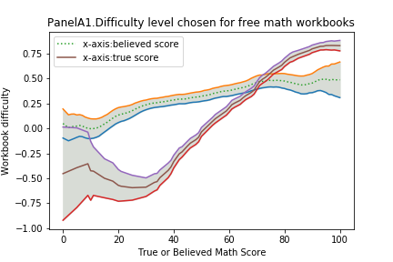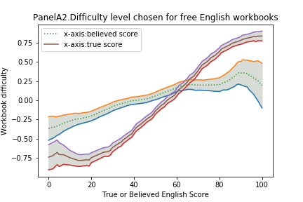
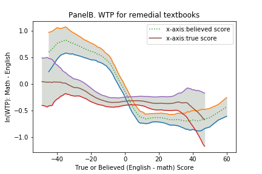

    
#### 4.2.2. Result B2: *Information substantially increases the slope of investments*

Figure 4. shows locally linear regressions of investments on actual performance. The dashed line is linear regressions of investments on true performance for treatment group and the solid line indicates the same regression but for control group. Both lines have true perfonmance as the x-axis. This figure tells that information frictions cause mistakes: That is, the information treatment substantially increases the slope of the investment functions. The prediction is that the infromation treatment makes the slope steeper. 

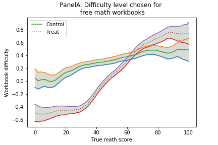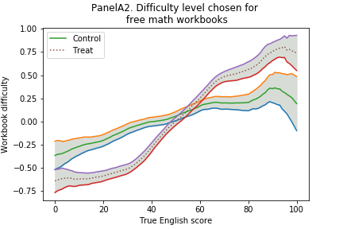

---
# 5. Extensions: Application to South Korea
---

This part is extension for the original paper. Dizon-Ross (2019) aruges that the inaccurate beliefs are more prevalent in the low income parents. Also, she verified that the educational investment relies on such beliefs. Meanwile, Chetty(2016) suggests that students from high income families are more likely to go to selective university. In this extension part, I would like to investigate that the richer parents are, the more their students are likely to get supported in South Korea. I focused on that this phenomenon usually happened in university entrance exam competition. I collected data 1) about the number of private institutes where students age of 11-17 are generally enrolled to prepare for university entrance exam in Seoul, 2) the price of lands in Seoul defined living purpose legally and 3) the postal code of each district in Seoul to visualize the data on the map. 

### 5.1. The distribution of private institutes
    
Figure 5.1 shows that the distribution of private intitutes in Seoul, South Korea. The institutes are selected by the ones which are related to university entrance exam which student age from 11- 17 are generally enrolled. Assuming that the original paper results are reliable, I would like to see then the student from high income familiy is more prepared for university entrance exam. The reason why I chose university entrance exam market is that first of all, university is widely considered as a path of social mobility. However, Chetty (2016) examined that students having high income parents is more likely to enrol selective shools than those having low income parents. It is questioning the validity of education as a role of encouraging social mobility. Those two references looks applicable to South Korea education market also because it is highly competitve and anecdotally the more famous a university is, the more rich students there are. 

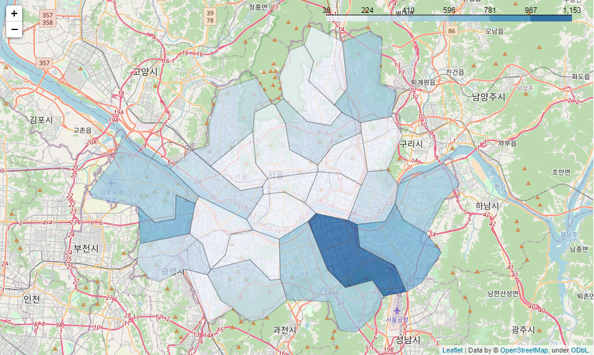

### 5.2. The average living purpose land price by districts
    
Figure 5.2 suggests that the average land price by districts in Seoul, South Korea. This land is selected by the purpose of living to use as a proxy of high income parents. I assumed that the students are enrolled at the private institute near their house. As the color is deeper, the average price is higher. This map shows that the average price of land is similar with the previous map which shows the distribution of prive institutes. With those two maps roughly suggest the possibility of relation between students' achievement in university entrance exam and their parents' financial status. 
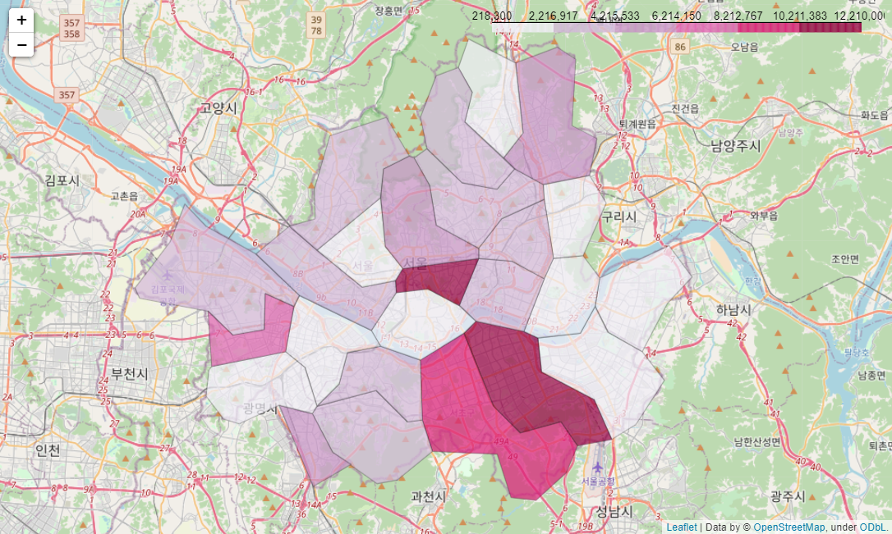

---
# 6. Conclusion
---

The interesting findings of this article is, firstly, that the school report cards do not gurantee to deliever children's school performance information perfectly. This is verified by using information intervention as a main treatment. Secondly, this research investigated that parents' investment decision on chilren's education depends on their beliefs. The author argues that the incorrect information will formulate incorrect beliefs of parents. Thus, it leads the parents to make inefficient investment decisions. Those findings are captured by experiments and empricial approaches. The test team collected the data by experiments and they analysis the data to induce these results. Moreover, there is a meaningful interpretation about the resullt which is such misbelief is more likely to be obeserved in low income parents. This can be divied into two path again. The one is less-educated parents have less accurate beliefs. The other one is that information has a larger effect among less-educated parents. 

---
# 7. Reference
---
- Dizon-Ross, Rebecca. 2019. "Parents' Beliefs about Their Children's Academic Ability: Implications for Educational Investments." American Economic Review, 109 (8): 2728-65.  
- Raj Chetty, John N Friedman, Emmanuel Saez, Nicholas Turner, Danny Yagan, Income Segregation and Intergenerational Mobility Across Colleges in the United States, The Quarterly Journal of Economics, Volume 135, Issue 3, August 2020, Pages 1567–1633, https://doi.org/10.1093/qje/qjaa005
- Seoul Datasets, http://data.seoul.go.kr/dataList/195/S/2/datasetView.do