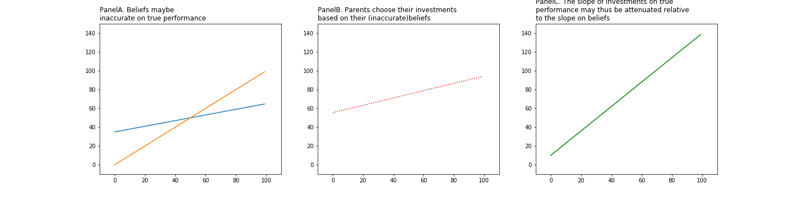

--- 
Project for the course in Effective Programming Practice | Winter 20/21, M.Sc. Economics, Bonn University | [Hyein Jeong](https://github.com/huiren-j)
# Replication of R. Dizon-Ross (2014)  <a class = "tocSkip">
---
 
**This repository** contains my replication of the results from the following paper:

> Dizon-Ross, Rebecca. 2019. "Parents' Beliefs about Their Children's Academic Ability: Implications for Educational Investments." American Economic Review, 109 (8): 2728-65.  
    

The structure of this repository is made by a template offered by --add. Thus the required environment is basically included in this template and can be generated by environment.yml.
    
**This replication** consists of files to produce 4 tables and 4 figures. In order to see the tables directly, simply run "table_produce.py" in "../src/final". It contains functions defined at "tables_management.py" and "tables_analysis.py". Each files include codes to prepare for analysis and to run the regressions. For the case of figures, they would be also produced by running "figures_produce.py". Likewise, the detailed functions for generating figures are in "figures_management.py" and "figures_analysis.py". All data for the analysis are in "src/original_data". In addition, I appended a short extenstion to show relation between education and parents' financial status with evidence of Seoul, the capital city of South Korea. This part will visualize land price and the number of private institute related to university entrance exams by district level. In order to see this result, use "extension.py". 
 

---

 
    
<h1>Table of Contents</h1>
<ul class="toc-item"><li><a href="#1.-Introduction" data-toc-modified-id="1.-Introduction-1">1.Introduction</a></li>
<li><a href="#2.-Theory Overview" data-toc-modified-id="2.-Theory Overview-2">2.Theory Overview</a></li>
<li><a href="#3.-Empirical Analysis" data-toc-modified-id="3.-Empirical Analysis-3">3.Empirical Analysis</a></li>
<li><a href="#4.-Identification" data-toc-modified-id="4.-Identification-4">4.Identifiation</a></li>
<li><a href="#5.-Replication of Decarolist(2014)" data-toc-modified-id="5.-Replication of Decarolist(2014)-5">5.Replication of Decarolist(2014)</a></li>
<ul class="toc-item"><li><a href="#5.1. Data-&amp;-Descriptive Statistics" data-toc-modified-id="#5.1. Data-&amp;-Descriptive Statistics-5.1">5.1. Data &amp; Descriptive Statistics</a></li>
<li><a href="#5.2. Results" data-toc-modified-id="#5.2. Results-5.2">5.2. Results</a></li>
<li><a href="#5.3. Robustness Checks" data-toc-modified-id="#5.3. Robustness Checks-5.3">5.3. Robustness Checks</a></li>
<li><a href="#5.4. IE Sample" data-toc-modified-id="#5.4. IE Sample-5.4">5.4. IE Sample</a></li>
</ul><li><a href="#6.-Extension" data-toc-modified-id="6.-Extension-7">6.Extension</a></li>
<ul class="toc-item"><li><a href="#6.1. Extension: Assumption Check with IE Sample" data-toc-modified-id="##6.1. Extension: Assumption Check with IE Sample-6.1">6.1. Extension: Assumption Check with IE Sample</a></li>
</ul><li><a href="#7.-Conclusion" data-toc-modified-id="7.-Conclusion-7">7.Conclusion</a></li>
<li><a href="#8.-Reference" data-toc-modified-id="8.-Reference-8">8.Reference</a></li>

 
 
    
---
# 1. Introduction
---
    
 
Dizon-Ross(2019) examined parents' beliefs about their children's academic ability. Since Parents are the decision maker for their children's education investment, it is important for parents to have good standard for the investment. The author argues that educational investment decision depends on the parents' beliefs about their children's academic ability. This kind of belief is generally formed by school report cards which is available for all for free. However, the author points out that this is not the case. Parents can be a factor to make differences in availability of the information about their children's academic performance. For example, if the parents have low level of education than their children's currently do, then it would be difficult for the parents to evaluate their children's school performance accurately. That is, parents could have inaccurate belief about their children's school performance due to lack of information and it lead the parents to make wrong investment decision on education.
    
**Main variables** 

| **Treatment**      | **Main outcomes**          | **Main Covariates**    |
|------------------- |----------------------------|------------------------|
 accurate Information about school performance| Winning discount           | Public Administration  |
|                    | Cost overrun               | Time                   |                         
|                    | Completion time delay      |                        |
|                    | Days to award the contract |                        |  

 
The main hypothesis is that parents' investment decisions rely on their beliefs. Figure 1. shows that the relation between beliefs and investments based on the hypothesis. PanelA implies that parents have prospensity to underestimate their children's ability if children's achievements are high, and to overestimate if children's achievements are low. Therefore, the author argues that if current investment is depending on their accurate beleifs, then correcting their beliefs by delievering accurate information will attenuate the slope on beliefs.
    

 

`s = "python hightlighting"`

